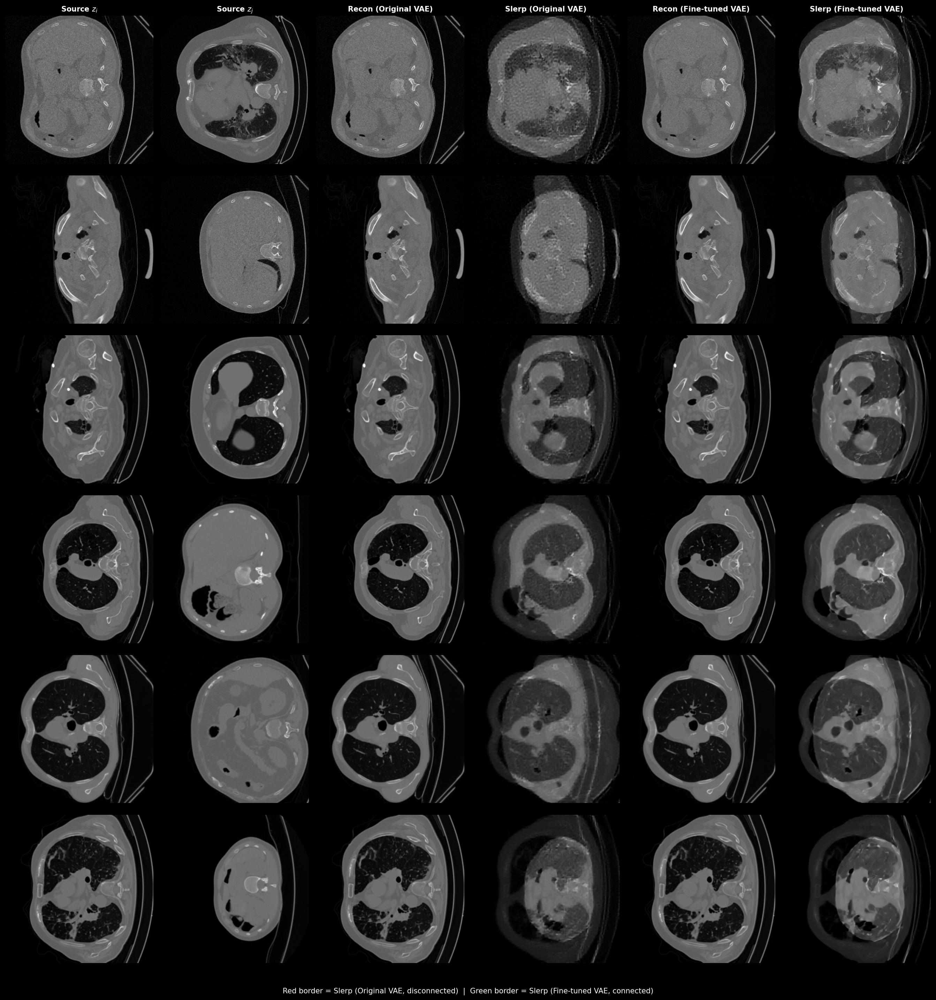
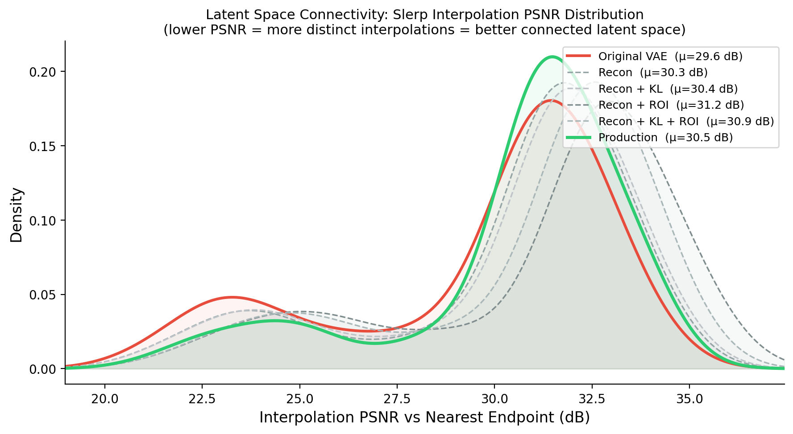

# CTFlow v2: what changed since last year's VLM3D submission

This is a retrospective on our second submission to the VLM3D / CT-RATE
text-to-CT challenge — a text-conditioned generative model that turns a
radiology report into a synthetic chest CT volume. Last year's system
worked. This year we went after the two things we thought were actually
limiting it — the VAE and classifier-free guidance — and then spent the
final submission cycle fighting a string of very unglamorous bugs to get
the result out the door. Both halves are worth writing down.

Links: [model + inference code](https://huggingface.co/EnyaWoooo/ctflowv2-vlm3d2026)
· synthetic dataset (link added once the generation run finishes — see the
end of this post).

## The architecture, briefly

CTFlow generates a CT volume autoregressively, block by block, in the
latent space of a VAE. A flow-matching transformer (STDiT-style) predicts
each new 16-frame latent block conditioned on (a) a text embedding of the
radiology report, encoded with BiomedVLP-CXR-BERT, and (b) the previous
block, so the model has continuity information to extend from. A learned
super-resolution adapter upsamples the final in-plane resolution to
512×512. This backbone didn't change between last year and this year —
what changed is the VAE it decodes into, whether it was trained with
classifier-free guidance, and, in the final weeks, a long list of
inference-time fixes.

Last year's submission script was `inference_bs_h_2gpus.py`, running the
base STDiT checkpoint (`checkpoint-680000`) against the stock VAE, no
guidance dropout during training (`p_drop_conditionning: 0.0` — the model
was never taught to produce a meaningful unconditional prediction).

## Change 1: fine-tuning the VAE for latent connectivity

The stock VAE reconstructs individual CT slices fine, but its latent
space isn't *connected* in the sense that matters for flow matching: take
two real latents, interpolate between them, decode the midpoint, and you
often get an anatomically implausible image — ghosting, structural
artifacts, tissue that doesn't correspond to any real CT. If the
transformer's flow-matching process has to pass through regions of latent
space like that on its way from noise to a valid sample, that's a direct
tax on generation quality.

We measure this with **interpolated FID (iFID)**, following Xu et al.:
encode two samples, slerp to the midpoint, decode, and compute FID of the
decoded midpoints against real data. A model with a well-connected latent
space produces midpoints that still look like real CT; a disconnected one
doesn't. The gap between iFID and ordinary reconstruction FID (rFID) is a
direct measure of *how much worse* interpolated latents are than latents
straight from the encoder — that's what we're targeting.

### ROI-aware connectivity loss

Generic connectivity losses (DINO-feature alignment, EQ-VAE-style
geometric consistency) exist for natural images, but they don't account
for something specific to medical volumes: diagnostic content is
concentrated in high-gradient regions (organ boundaries, lesions, tissue
interfaces), while large areas — background, uniform soft tissue — carry
almost no signal (on abdominal CT, ~98% of spectral energy sits in
low-frequency components). Enforcing uniform connectivity everywhere
wastes loss budget on regions nobody cares about.

So during VAE fine-tuning, for each training pair $(x_a, x_b)$ in a
batch we:

1. Encode both, take the posterior means $z_a, z_b$.
2. Slerp to a midpoint $\hat z_{ab}(\alpha)$ (spherical, not linear, to
   respect the Gaussian prior), decode it to $\hat x_{ab}$.
3. Build a binary ROI mask from a Sobel edge map of $x_a$ and $x_b$
   (union of both), thresholded at 0.1 of the max gradient magnitude.
4. Compute the connectivity loss as the *minimum* LPIPS distance,
   restricted to the ROI mask, between $\hat x_{ab}$ and each of the two
   endpoints:

$$
\mathcal{L}_{\text{ROI}} = \min\Big(
  d_{\text{LPIPS}}(\hat x_{ab}\!\odot\! M, x_a\!\odot\! M),\;
  d_{\text{LPIPS}}(\hat x_{ab}\!\odot\! M, x_b\!\odot\! M)
\Big)
$$

The min (rather than forcing the midpoint to match a pixel-blend of both
endpoints) just asks that the midpoint stay plausible with respect to
*at least one* endpoint in the regions that matter — a much easier and
more honest target than exact interpolation.

Full objective: standard reconstruction (L1 + LPIPS + adversarial) + KL +
this connectivity term, with two schedules layered on top — KL ramps
linearly from step 1,000–3,000 to a plateau of 1e-2 (immediately turning
on all losses destabilizes the encoder early), and the ROI weight has a
delayed ramp (steps 2,000–5,000, up to 0.15) followed by cosine annealing
down to 0.075 by step 10,000, so reconstruction gets to refine cleanly in
the back half of training. We also supervise multiple interpolation
points per pair ($\alpha \in \{0.3, 0.5, 0.7\}$), not just the midpoint.



Six pairs of CT slices, each row picked from a different anatomical
region. `Recon` columns show that fine-tuning doesn't cost reconstruction
quality — both VAEs faithfully reproduce the input. The `Slerp` columns
are the actual test: decode the midpoint between $z_i$ and $z_j$ with no
real image ever having produced it. With the **original VAE**, that
midpoint is visibly broken — a fine-grained checkerboard texture stamped
over blurred, structurally wrong anatomy, worse the further apart the two
source slices are (see row 4, where $z_j$ is a mostly-empty top-of-lung
slice). With the **fine-tuned VAE**, the same midpoints look like
plausible intermediate anatomy: coherent organ boundaries, no grid
artifacts, structure that's obviously *between* the two endpoints rather
than a broken average of them. This is the failure mode the connectivity
loss is directly targeting, made visible.

### Did it work

| Method | PSNR ↑ | rFID ↓ | iFID ↓ | Gap ↓ |
|---|---|---|---|---|
| Pretrained VAE | 37.40 | **12.30** | 67.85 | 55.55 |
| Recon only | 38.33 | 16.72 | 62.07 | 45.35 |
| Recon + KL | 38.36 | 18.09 | 60.42 | 42.32 |
| Recon + ROI | 38.16 | 16.07 | 53.72 | 37.65 |
| Recon + KL + ROI | 37.73 | 16.67 | 51.23 | 34.56 |
| **Production** (all + schedules + multi-α) | 37.44 | 17.39 | **39.88** | **22.49** |

The production configuration cuts the disconnection gap by ~60% relative
to the pretrained baseline (55.55 → 22.49), at the cost of a few points
of rFID — a reasonable trade given rFID measures something we don't
directly optimize for generation quality. We also looked at the
distribution, not just the mean:



For each validation sample, slerp it against its nearest neighbor,
decode, and take the higher of its PSNR against either endpoint —
*lower* PSNR means the decoded midpoint is genuinely distinct from both
endpoints, not just a copy of the closer one. Kernel density estimates of
per-sample interpolation PSNR show the production model and the
pretrained VAE both have a real mass of low-PSNR (genuinely novel,
non-collapsed) midpoints, while the ablation variants concentrate at
higher PSNR — i.e. their
"interpolations" are closer to just reproducing an endpoint. Schedule and
multi-α mattered; none of the individual loss terms alone got us there.

## Change 2: classifier-free guidance

Last year's base checkpoint was trained with `p_drop_conditionning: 0.0`
— text conditioning was never dropped during training, so there's no
learned unconditional branch and no meaningful way to apply CFG at
inference. This year's spacing fine-tuning runs (both the initial round
and the continuation) set `p_drop_conditionning: 0.1`, the standard
10% text-dropout rate, specifically so we'd have that capability.

**Where this stands is an open question, not a result.** We swept
guidance scale at inference and didn't see a clear, consistent
improvement — sometimes better, sometimes not, nothing we could point to
as a reliable win. We don't have a solid explanation yet (interaction
with the autoregressive block conditioning? the previous-block signal
already gives the model plenty to condition on, diluting what dropping
the *text* branch alone accomplishes?), and we didn't have time to run
it down properly this cycle. The production model ships without CFG
applied at inference, even though it was trained to support it. Flagging
this honestly rather than pretending it was resolved.

## The submission cycle: what actually broke

Everything above was settled weeks before the deadline. The last
stretch was a different kind of work — real-submission debugging under a
$35-per-run cost and a hard clock, most of it self-inflicted complexity
we then had to dig back out of.

**The 256-frame ceiling.** Our training data preprocessing center-crops
every volume to 256 slices. That's an invisible hard boundary: whatever
the autoregressive model draws past 256 frames, it has *never seen
anything like it* in training, regardless of prompt. An early real
submission scored badly (FVD 0.53) for exactly this reason — nothing
wrong with the model, we just let generation run past the one boundary
that mattered. Capping `max_blocks` at 16 (16×16 = 256 frames) fixed it
immediately.

**Declared vs. conditioned spacing.** We found, empirically, that
conditioning the model on a *coarser* z-spacing (3.0mm) than what we
actually declare in the output header (1.5mm, or an adaptive value
computed to keep every volume's block at a fixed 384mm physical extent)
nudges it toward more anatomically varied output — the model doesn't
proportionally rescale real content to whatever spacing it's told, so
this is a legitimate (if slightly hacky) way to push it out of a
repetitive part of its learned distribution. This one small decoupling
outperformed every geometry variant we tried against the actual
challenge FID/FVD metrics.

**A selection-method dead end.** We tried scoring candidates by
Mahalanobis "typicality" against the published dataset's feature
distribution and picking the most typical one. It measurably *hurt* FVD
(0.24 → 0.40) — it shrinks the effective covariance of what gets
published, making outputs too safe/average relative to real data's actual
spread. Good reminder that "pick the most normal-looking one" and "match
the real distribution" are not the same objective.

**A seed bug that only showed up in retrospect.** Our candidate-diversity
scheme used seeds of the form `base + 977*k`. For `k = 1..4`, this
combination deterministically triggered the model's early-stop condition
on the very first block, *regardless of prompt content* — confirmed by
testing the same seeds against four different real reports. For most of
the cycle this silently made our "5 diverse candidates" selection
effectively "1 real candidate + 4 immediate no-ops," which we didn't
catch because the no-ops get filtered out before scoring, so nothing
looked obviously wrong. We replaced the formula with a small pool of
seeds individually verified non-degenerate across multiple real prompts.

**A safety net that silently never ran.** We added a CT-CLIP-based
quality check late in the cycle: score the selected candidate against its
own report text, and if it scores below 0.5, redraw with a backup seed
pool and take whichever of the combined pool scores highest — a real
guardrail against selecting an anatomically-plausible-but-semantically-
wrong candidate. It worked in every local test. It did not work in the
actual submission: the vendored CT-CLIP source has its own hardcoded
`BertTokenizer.from_pretrained('microsoft/BiomedVLP-CXR-BERT-specialized')`
call, buried inside the model class constructor, completely independent
of the local path we were correctly passing everywhere else. Local
testing has internet access, so that line quietly succeeded by phoning
home to the Hub; the actual submission container runs fully offline
(`TRANSFORMERS_OFFLINE=1`), where it failed, got caught by an exception
handler, and the whole safety net silently no-op'd for the entire
100-prompt run — CLIP scores were computed, thresholds checked, nothing
printed to indicate anything was wrong, because "print nothing extra" was
exactly what the success path did too. One submission's worth of real
compute spent validating a component that had never actually run once.
Fixed by pointing that specific line at the local path when it exists,
falling back to the Hub id otherwise.

**Compile mode was the wrong tool for this workload.** Once the CLIP
safety net actually started firing, retries meant redrawing at a
different batch size than the main pass, and every new autoregressive
block length is technically a new tensor shape. We'd been compiling with
`mode="max-autotune-no-cudagraphs"`, which exhaustively benchmarks
several kernel candidates per operator *every time it meets a shape it
hasn't seen* — fine if you run the same few shapes thousands of times,
actively expensive if your workload naturally produces a wide spread of
shapes and hits each only a handful of times, which describes
variable-length autoregressive generation pretty exactly. Dropping to
default compile mode barely moved single-call latency (~2%); the
retry pool size mattered far more — cutting it from 5 seeds to 2 (and
resolving retries by taking the best-CLIP candidate across the combined
pool directly, instead of re-running the whole jerk-median selection a
second time) cut total wall-clock by about a third in controlled,
same-environment comparisons.

## Where it landed, and what's still open

Best real result this cycle: FVD 0.239, a meaningful improvement over
our own earlier submissions and over the naive-typicality-selection
variant. A few things are deliberately left unresolved rather than
overclaimed:

- The spacing fine-tune was run in two rounds (a second continuation on
  top of the first checkpoint), and round 2 was adopted as the default
  early in the cycle without ever being A/B tested against round 1 alone.
- CFG training capability exists; inference-time benefit doesn't, and we
  don't yet know why.
- The retry pool was cut from 5 to 2 seeds under real time pressure, on
  the reasoning that the winning seed in our test cases was already in
  the smaller pool — true in the cases we checked, not something we
  validated at scale before the final submission.

## Links

- Model + inference pipeline + the exact submitted container:
  [huggingface.co/EnyaWoooo/ctflowv2-vlm3d2026](https://huggingface.co/EnyaWoooo/ctflowv2-vlm3d2026)
- Synthetic CT-RATE validation set (1,516 unique reports, one generation
  each): *link to follow once the run finishes.*

## Citation

If you use CTFlow, the fine-tuned VAE, or this write-up, please cite the
base paper and, for this year's system specifically, this repository:

```bibtex
@article{wang2025ctflow,
  title   = {CTFlow: Video-Inspired Latent Flow Matching for 3D CT Synthesis},
  author  = {Wang, Jiayi and Reynaud, Hadrien and Erick, Franciskus Xaverius and Kainz, Bernhard},
  journal = {arXiv preprint arXiv:2508.12900},
  year    = {2025}
}

@misc{wang2026ctflowv2,
  title        = {CTFlow v2: VLM3D 2026 Submission},
  author       = {Wang, Jiayi},
  year         = {2026},
  howpublished = {\url{https://github.com/WongJiayi/CTFlow-v2}},
  note         = {Model weights and inference code: \url{https://huggingface.co/EnyaWoooo/ctflowv2-vlm3d2026}}
}
```
